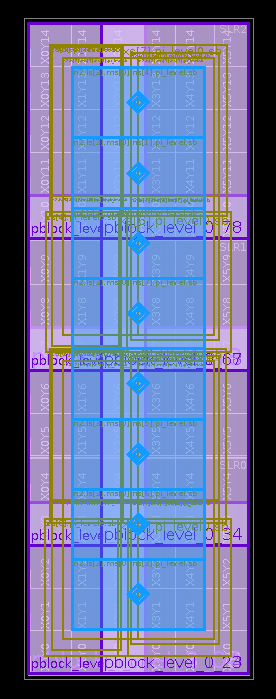

# Flow-Controlled Butterfly Fat Trees

[](https://git.uwaterloo.ca/jzjekel/bft-credit-vcs/-/commits/main)

We provide a set of plug and play demos for you to rapidly test our NoC for popular (Synthetic + FPGA Accelerator traces) benchmarks. Apart from functional
verification, our demos will also help you quantify the NoC on various fronts of performance, FPGA mapping and topology selection.

>    *Gurshaant Singh Malik and Nachiket Kapre*

>    [**"Enhancing Butterfly Fat Tree NoCs for FPGAs with lightweight flow control"**](https://nachiket.github.io/publications/enhanced-bft_fccm-2019.pdf),

>    International Conference on Field Programmable Custom Computing Machines, Apr 2019 


### Instructions for Demos:

We have packaged our simulation and verification eco-system into easy-to-understand demos for rapidly getting off the ground. The demos are broadly classified 
into 2 categories:
* **Functional Demos** : For functional verification + performance characterization of the NoC via simulation
* **FPGA Mapping Demos** : For FPGA mapping of the NoC for hardware characterization via Xilinx's implementation pipeline 

The demos are packaged to provide you easy to parse performance and FPGA mapping results. More details about each follow.

#### Functional Demos :

##### Pre-Requisites:
* num-utils
* parallel
* verilator

Our functional demos use [Verilator](https://www.veripool.org/wiki/verilator) as the simulation back-end. We package our functional eco-system into a simple Makefile
application. We have distilled a wide array of NoC and trace configurations to [Makefile Arguments](https://stackoverflow.com/questions/2214575/passing-arguments-to-make-run),
effectively allowing you to run a wide range of experiments via a single API as follows:

##### Instructions on running the functional demos.

From the [root](https://git.uwaterloo.ca/watcag-public/bft-flow/tree/master/) folder of the repository, you can run the following
command
```bash
make run_func_demo TOPO=$TOPO PE=$PE RATE=$RATE TRACE=$TRACE

Arguments:
    TOPO:  The topology of the NoC. Valid options are :
            1. BFT0 
            2. BFT1 
            3. BFT2
            4. BFT3
    PE:     The system size of the NoC. It should be a positive multiple of 2
    RATE:   The injection rate of traffic. It should be non-negative number not exceeding 100
    TRACE:  The type of traffic that needs to be injected into the NoC. Valid options are :
            Synthetic :  
            1. random       2. local  
            Real Accelerator:  
            1. add20        8. human 
            2. amazon       9. roadnet
            3. bomhof_1     10. simucad_dac
            4. bomhof_2     11. simucad_ram2k
            5. bomhof_3     12. soc
            6. google       13. stanford
            7. hamm         14. wiki
                    
Example:
> make run_func_demo TOPO=BFT3 PE=4 RATE=100 TRACE=google
```

##### Understanding the output of the demo

After running the demo, you should expect the application to output key information pertaining to the run, as shown below:

```bash
> make run_func_demo TOPO=BFT3 PE=4 RATE=100 TRACE=google
    ar: creating Vbft__ALL.a
    ************************************************
    Topology=BFT3, PE=4, RATE=100, TRACE=google
    ************************************************
    Switching Activity=.02515659627002357798
 
    Packets Sent = 729996, Packets Received = 729996
 
    Cycles = 197642,  NoC sustained Rate = .923
 
    Worst Inflight Latency = 5, Worst Total Latency = 32
```
We now explain how to understand this output to aid you in extracting key information about the NoC's performance characteristics.

*   **Switching Activity** : The fraction of switch level toggles in the total runtime
*   **Packets Sent**       : The total number of packets sent by the client connected to the NoC
*   **Packets Received**   : The total number of packets received by the clients connected to the NoC
*   **Cycles**             : The number of simulation cycles required for all packets to be routed through the NoC
*   **NoC sustained rate** : The sustained rate of the NoC, represented as a fraction
*   **Worst Inflight Latency** : The worst observed routing time taken by a packet to route through a NoC
*   **Worst Total Latency**    : The worst observed end-to-end routing time taken by a packet to be received at the destination

To aid you in creating visual charts of the data, we also add these performance logs in both `csv` and `txt` format under the file name `fc_bft.csv` and `fc_bft.txt`
at the [perf](https://git.uwaterloo.ca/watcag-public/bft-flow/tree/master/results/perf) folder 
 
#### FPGA Mapping Demos:

##### Pre-Requisites:
* num-utils
* python3
* parallel
* Xilinx Vivado 2017.4

Our functional demos use [Xilinx Vivado 2017.4](https://www.xilinx.com/support/download/index.html/content/xilinx/en/downloadNav/vivado-design-tools/2017-4.html) 
as the implementation back end. We package our hardware mapping pipeline into a simple Makefile application. In similar taste to functional demos, we have 
distilled a wide array of NoC configurations to [Makefile Arguments](https://stackoverflow.com/questions/2214575/passing-arguments-to-make-run), effectively 
allowing you to run a wide range of experiments via a single API as follows:

##### Instructions on running the hardware mapping demos.

From the [root](https://git.uwaterloo.ca/watcag-public/bft-flow/tree/master/) folder of the repository, you can run the following
```bash
make run_hw_mapping TOPO=$TOPO PE=$PE DW=$DW

Arguments:
    TOPO:  The topology of the NoC. Valid options are :
            1. BFT0 
            2. BFT1 
            3. BFT2
            4. BFT3
    PE:     The system size of the NoC. It should be a positive multiple of 2
    DW:     The bus width of the data payload channel of the NoC   
    
Example:
> make run_hw_mapping TOPO=BFT0 PE=4 DW=32
```

##### Understanding the output of the demo
After running the demo, you should expect the application to output key information pertaining to the run, as shown below:

```bash
> make run_hw_mapping TOPO=BFT0 PE=4 DW=32
*****************************
Topology=BFT0, PE=4, DW=32
*****************************
Achievable Frequency (MHz) = 903
FPGA LUTs Consumed = 724
FPGA Flip Flops Consumed = 862
Total Power (W) = 2.661 Dynamic Power (W) = 0.092 (rate=10)
Total Power (W) = 2.686 Dynamic Power (W) = 0.116 (rate=20)
Total Power (W) = 2.709 Dynamic Power (W) = 0.139 (rate=30)
Total Power (W) = 2.731 Dynamic Power (W) = 0.160 (rate=40)
Total Power (W) = 2.752 Dynamic Power (W) = 0.181 (rate=50)
Total Power (W) = 2.848 Dynamic Power (W) = 0.276 (rate=100)
```
To aid you in creating visual charts of the data, we also add these performance logs in `csv` and `txt` format under the file names `fc_bft_freq.csv`, `fc_bft_freq.txt`
+ `fc_bft_area.csv`, `fc_bft_area.txt` + `fc_bft_power.csv`, `fc_bft_power.txt` at the [hw_mapping](https://git.uwaterloo.ca/watcag-public/bft-flow/tree/master/results/hw_mapping) folder 

You can also generate floorplanned versions of the BFT by running `make run_hw_mapping_fp`

### Adapting the NoC to use your workload

If you want to test our NoC for performance or verification with any other traffic trace, please find the instructions below. Before adding your workload trace,
you will first have to understand the format our NoC accepts as a valid trace.

#### Understanding the trace format.
For each client, the trace format expects the same rule : A hex represented 9 bit binary string composed of the following : Stop Bit (1 bit) + Destination PE Address (8 bits). Note
that the payload here is synthetically generated by the client and does not need to be part of the trace. 

We now present a snippet of the `google` accelerator trace :

```
007
00c
003
007
00c
00c
00c
00c
00d
003
```
All client traces end with the same string `f00`, where the stop bit is asserted. At this point, we encourage you to head over to the 
[bench directory](https://git.uwaterloo.ca/watcag-public/bft-flow/tree/master/bench) and [choose a trace](https://git.uwaterloo.ca/watcag-public/bft-flow/tree/master/bench/add20) 
and [system size](https://git.uwaterloo.ca/watcag-public/bft-flow/tree/master/bench/add20/16). You will observe that each 
[client trace](https://git.uwaterloo.ca/watcag-public/bft-flow/blob/master/bench/add20/16/autogen_10.trace) follows the same exact pattern.

#### Adding your workload
* For the NoC size of your interest, you will need to create workload traces for each of your endpoints. Each trace needs to be named as `autogen_<client_id>.trace`,
where `client_id` is the 0-indexed id of your client. For example, if you are adding workloads for a NoC with 
[4 endpoints](https://git.uwaterloo.ca/watcag-public/bft-flow/tree/master/bench/add20/4), the files will be named as : `autogen_0.trace`, `autogen_1.trace`. `autogen_2.trace` and `autogen_3.trace`

* Traces for each NoC size will be housed in a separate folder. The name of the folder will be system size itself. For example, if you have a [64 end-points
system](https://git.uwaterloo.ca/watcag-public/bft-flow/tree/master/bench/add20/64), the folder name should be `64`
* All the various system size folders will be housed in a common folder with the trace name of your choosing. For example , for the 
[add20](https://git.uwaterloo.ca/watcag-public/bft-flow/tree/master/bench/add20) workload trace, different system size workloads are under the folder `add20`

To further aid clarity, we present the folder structure expected below for a workload `my_trace` with a system size of 4 and 8:

```
- bft_flow
    - bench
        - my_trace
            - 4
                - autogen_0.trace
                - autogen_1.trace
                - autogen_2.trace
                - autogen_3.trace
            - 8
                - autogen_0.trace
                - autogen_1.trace
                - autogen_2.trace
                - autogen_3.trace
                - autogen_4.trace
                - autogen_5.trace
                - autogen_6.trace
                - autogen_7.trace
```

#### Running your workload with our NoC
Once you have successfully created a workload, it is quite straight-forward to run it with our NoC. You can use our previously discussed Makefile command
with the trace argument pointing to the name of your workload.

We show an example of how to run the workload for the previously generated `my_trace` for a system size of 8 on a `BFT1` NoC.

```bash
> make run_func_demo TOPO=BFT1 PE=8 RATE=100 TRACE=my_trace
```

### Referring to the data from the paper

To refer to the data quoted in the paper, please go to the [results directory](https://git.uwaterloo.ca/watcag-public/bft-flow/tree/master/results), where you
will be able to access data grouped by performance and hardware mapping respectively. 

### Understanding the RTL structure

We now explain the [RTL](https://git.uwaterloo.ca/watcag-public/bft-flow/tree/master/rtl) structure of our BFT design. To aid understanding, please refer below to the module level breakdown of a 4 client `BFT1` NoC. 


We also present a high level summary of each file below:

* **bft.v** : This file ties the BFT NoC topology with client logic
* **client_bp_top.v** : This file contains the client logic with the flow control logic.
* **client_bp.v** : This file defines the behaviour of clients to inject and receive traffic
* **bp.v** : This file architects the flow control interface
* **pi_switch_top.v** : This file ties the _pi_ switch with the flow control logic
* **pi_switch.v** : This file contains the muxing logic along with the routing control logic of the _pi_ switch
* **pi_route.v** : This file contains the routing control logic for the _pi_ switch
* **t_switch_top.v** : This file ties the _t_ switch with the flow control logic
* **t_switch.v** : This file contains the muxing logic along with the routing control logic of the _t_ switch
* **t_route.v** : This file contains the routing control logic for the _t_ switch

### Floor-Planned Images of a 16 PE BFT3

<div id="image-table">
    <table>
	    <tr>
    	    <td style="padding:1px">
        	    
        	    <figcaption>Level 3</figcaption>
      	    </td>
            <td style="padding:1px">
            	
                <figcaption>Level 2</figcaption>
            </td>
            <td style="padding:1px">
        	    
        	    <figcaption>Level 1</figcaption>
      	    </td>
            <td style="padding:1px">
            	
            	<figcaption>Level 0</figcaption>
             </td>
        </tr>
    </table>
</div>

### License
This tool is distributed under MIT license.

Copyright (c) 2019 Gurshaant Singh Malik, Nachiket Kapre

Copyright (c) 2024 Nachiket Kapre

Copyright (c) 2024 John Zacarias Jekel

<div style="text-align: justify;"> 
Permission is hereby granted, free of charge, to any person obtaining a copy of this software and associated documentation files (the "Software"), to deal in the Software without restriction, including without limitation the rights to use, copy, modify, merge, publish, distribute, sublicense, and/or sell copies of the Software, and to permit persons to whom the Software is furnished to do so, subject to the following conditions:
<br><br>
</div>


<div style="text-align: justify;"> 
<b>The above copyright notice and this permission notice shall be included in all copies or substantial portions of the Software.</b>
<br><br>
</div>


<div style="text-align: justify;"> 
THE SOFTWARE IS PROVIDED "AS IS", WITHOUT WARRANTY OF ANY KIND, EXPRESS OR IMPLIED, INCLUDING BUT NOT LIMITED TO THE WARRANTIES OF MERCHANTABILITY, FITNESS FOR A PARTICULAR PURPOSE AND NONINFRINGEMENT. IN NO EVENT SHALL THE AUTHORS OR COPYRIGHT HOLDERS BE LIABLE FOR ANY CLAIM, DAMAGES OR OTHER LIABILITY, WHETHER IN AN ACTION OF CONTRACT, TORT OR OTHERWISE, ARISING FROM, OUT OF OR IN CONNECTION WITH THE SOFTWARE OR THE USE OR OTHER DEALINGS IN THE SOFTWARE.
 </div>
